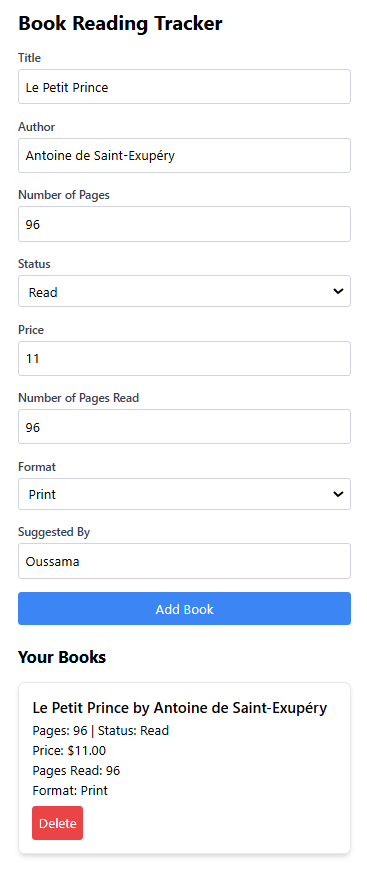
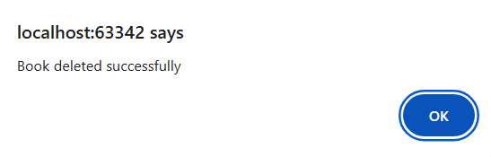

# Rapport sur l'Application de Suivi de Lecture

## Introduction

Ce document présente l'application de suivi de lecture développée pour aider les utilisateurs à gérer leurs livres. L'application permet d'ajouter, d'afficher et de supprimer des livres, tout en fournissant une interface utilisateur simple et intuitive.

## Technologies Utilisées

- **Frontend :**
  - HTML
  - CSS (Tailwind CSS)
  - JavaScript (ES6 modules)

- **Backend :**
  - Node.js
  - Express.js
  - MongoDB (Mongoose)

## Fonctionnalités

### 1. Ajouter un Livre
Les utilisateurs peuvent ajouter un nouveau livre en remplissant un formulaire avec les informations suivantes :
- Titre
- Auteur
- Nombre de pages
- Statut de lecture
- Prix
- Nombre de pages lues
- Format
- Suggéré par

### 2. Afficher la Liste des Livres
Tous les livres ajoutés sont affichés dans une liste. Chaque entrée comprend :
- Titre et auteur
- Nombre de pages et statut
- Prix
- Pages lues
- Format
- Bouton de suppression

### 3. Supprimer un Livre
Les utilisateurs peuvent supprimer un livre de la liste en cliquant sur le bouton "Delete" associé à chaque livre.

## Aperçu de l'Interface Utilisateur



## Architecture de l'Application

### Structure des Dossiers

```
/votre-projet
│
├── index.html
├── app.js
├── book.js
└── server.js
```

### Backend

Le backend est construit avec Express.js et MongoDB pour gérer les opérations CRUD sur les livres. Voici un extrait du code :

```javascript
// Extrait de la route pour ajouter un livre
app.post('/books', async (req, res) => {
    try {
        const bookData = req.body;
        const newBook = new Book(bookData);
        await newBook.save();
        res.status(201).send(newBook);
    } catch (error) {
        res.status(500).send("Error saving book");
    }
});
```

### Frontend

Le frontend utilise HTML et JavaScript pour fournir une interface utilisateur dynamique. Voici un extrait du code d'affichage des livres :

```javascript
// Fonction pour récupérer et afficher tous les livres
function fetchBooks() {
    fetch('http://localhost:3000/books')
        .then(response => response.json())
        .then(books => {
            // Logique d'affichage
        });
}
```

## Conclusion

Cette application de suivi de lecture offre une solution simple et efficace pour gérer ses livres. Grâce à l'utilisation de technologies modernes, elle fournit une expérience utilisateur fluide et intuitive.

## Images et Graphiques

Ajout d un livre : 


suppression d un livre : 
