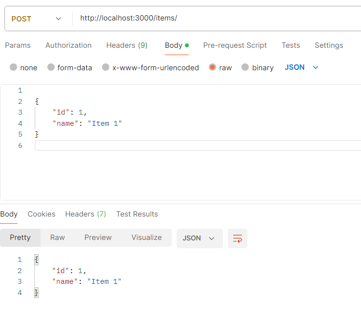
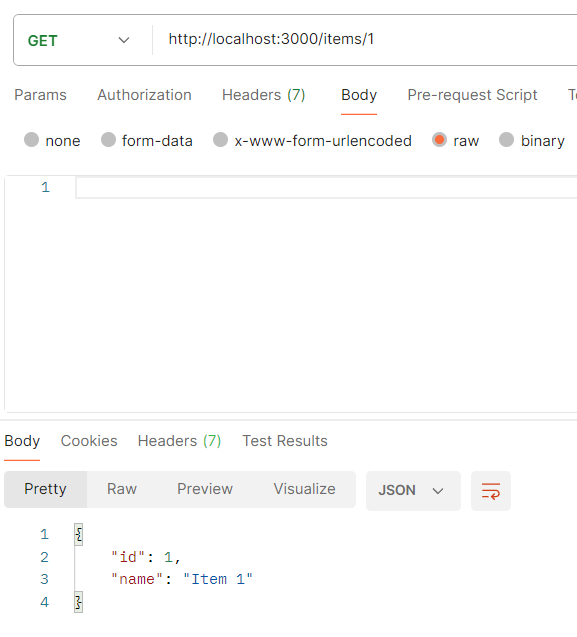

# Express.js CRUD Application Report

## 1. What is Express.js and What Can We Build with It?

**Express.js** is a fast, unopinionated, minimalist web framework for Node.js. It provides robust features for building web and mobile applications. With Express, you can build various applications, including:

- Web applications (single-page, multi-page, and hybrid)
- RESTful APIs
- Backend services for mobile apps
- Real-time chat applications
- E-commerce platforms

## 2. What are Middlewares and How Are They Used in Express.js?

**Middleware** functions in Express.js are functions that have access to the request (`req`) and response (`res`) objects, and the `next()` function, which is a reference to the next middleware to be executed. Middlewares can perform actions such as modifying request and response objects, ending the request-response cycle, or calling the next middleware in the stack.

### Example 1: Logging Middleware
```javascript
const express = require('express');
const app = express();

const loggerMiddleware = (req, res, next) => {
    console.log(\`\${req.method} \${req.url}\`);
    next(); 
};

app.use(loggerMiddleware);

app.get('/', (req, res) => {
    res.send('Home Page');
});

app.listen(3000, () => console.log('Server running on port 3000'));
```
**Explanation:** This middleware logs the HTTP method and URL of every request and then calls `next()` to pass control to the next middleware or route handler.

### Example 2: Authentication Middleware
```javascript
const authenticate = (req, res, next) => {
    if (req.headers.authorization === 'Bearer token') {
        next(); 
    } else {
        res.status(403).send('Forbidden');
    }
};

app.get('/protected', authenticate, (req, res) => {
    res.send('You have access to this protected route');
});
```
**Explanation:** The `authenticate` middleware checks for an authorization token and only allows access to the protected route if the token is valid. Otherwise, it sends a `403 Forbidden` response.

---

## Creating a Simple CRUD Application with Express.js

Here is a step-by-step guide to creating a simple CRUD (Create, Read, Update, Delete) application using Express.js.

### Step 1: Create a Project Directory
```bash
mkdir express-crud-app
cd express-crud-app
```

### Step 2: Initialize a Node.js Project
```bash
npm init -y
```
**Explanation:** This command will generate a `package.json` file that holds project metadata and dependencies.

### Step 3: Install Express
```bash
npm install express
```
**Explanation:** This installs Express.js as a dependency in the project.

### Step 4: Set Up Express and Run the Server
Create a file called `app.js` and write the following code:

```javascript
const express = require('express');
const app = express();
app.use(express.json()); // Allows Express to parse JSON request bodies

app.listen(3000, () => {
    console.log('Server is running on port 3000');
});
```
**Explanation:** Here, we create an Express app and set it to listen on port 3000. `express.json()` middleware allows parsing incoming JSON requests.

### Step 5: Create a POST Endpoint to Add Items
```javascript
let items = [];

app.post('/items', (req, res) => {
    const newItem = req.body;
    items.push(newItem);
    res.status(201).send(newItem);
});
```
**Explanation:** This POST endpoint allows the client to add a new item to the `items` array. The request body contains the item data, which is then added to the array.

### Step 6: Create a GET Endpoint to Retrieve All Items
```javascript
app.get('/items', (req, res) => {
    res.send(items);
});
```
**Explanation:** This GET endpoint allows the client to retrieve all the items stored in the `items` array.

### Step 7: Create a GET Endpoint by ID
```javascript
app.get('/items/:id', (req, res) => {
    const item = items.find(i => i.id === parseInt(req.params.id));
    if (!item) return res.status(404).send('Item not found');
    res.send(item);
});
```
**Explanation:** This GET endpoint allows the client to retrieve a specific item by its `id`. The `id` is passed as a URL parameter.

### Step 8: Create a PUT Endpoint to Update an Existing Item
```javascript
app.put('/items/:id', (req, res) => {
    const item = items.find(i => i.id === parseInt(req.params.id));
    if (!item) return res.status(404).send('Item not found');

    Object.assign(item, req.body);
    res.send(item);
});
```
**Explanation:** This PUT endpoint allows the client to update an existing item. The `id` parameter is used to locate the item, and the request body contains the new values to update the item.

### Step 9: Create a DELETE Endpoint to Delete an Item
```javascript
app.delete('/items/:id', (req, res) => {
    const itemIndex = items.findIndex(i => i.id === parseInt(req.params.id));
    if (itemIndex === -1) return res.status(404).send('Item not found');

    const deletedItem = items.splice(itemIndex, 1);
    res.send(deletedItem);
});
```
**Explanation:** This DELETE endpoint allows the client to delete an item by its `id`. If the item is found, it is removed from the `items` array.

### Step 10: Start the Server
In your terminal, run the server using:
```bash
node app.js
```

### Step 11: Test the Endpoints Using Postman
- **POST /items**: Add a new item with a JSON body like `{ "id": 1, "name": "item1" }`.
---

---


- **GET /items**: Retrieve all items.
---

---
- **GET /items/:id**: Retrieve a specific item by its `id`.
---

---
- **PUT /items/:id**: Update an item by its `id`.
---

---
- **DELETE /items/:id**: Delete an item by its `id`.
---

---
